<picture>
  <source media="(prefers-color-scheme: dark)" srcset="assets/banner-dark.svg">
  
</picture>

Computer science engineer from Madrid, finishing a master's in Computer Science Engineering at Universidad Carlos III de Madrid (2025 – 2027). I like the low levels of the stack — C, CUDA, compilers, distributed systems — and I like building small tools that make student life easier.

Most recently I spent the summer of 2026 as a research assistant at UC3M, building tools that automate data extraction, cleaning and visualisation for the EITEL project. Before that, an exchange year at the University of Illinois Urbana-Champaign and six years on the Student Council of the Escuela Politécnica Superior.

Full CV at [astrak.es](https://astrak.es).

## Things I've built

- [**AGDownloader**](https://github.com/Astrak00/AGDownloader) — a Go CLI that downloads every file from your courses on Aula Global, UC3M's Moodle, in one go.
- [**StyleSnap**](https://github.com/Astrak00/StyleSnapApp) — an iOS app that recognises garments from a photo with a PyTorch model, so you know what's in your wardrobe, and recommends what goes with what.
- [**Locker reservations**](https://servicios-delegacion.uc3m.es/) for the Student Council — Svelte front end on a Go back end, with automated backups and a back end tuned to 700+ requests per second. ([front end source](https://github.com/Delegacion-EPS-UC3M/servicios-frontend))
- Coursework from the bachelor's and the UIUC exchange is public — see [astrak.es/universidad](https://astrak.es/universidad).

## Languages and tools

  
  
  
  
  
  
  
  
  
  
  
  
  
  
  
  
  
  
  
  
  

Currently learning Rust.

## Contact

- [LinkedIn](https://linkedin.com/in/eduardo-alarcon-navarro)
- [edualanav@gmail.com](mailto:edualanav@gmail.com)
- Pronouns: he/him

<picture>
  <source media="(prefers-color-scheme: dark)" srcset="https://raw.githubusercontent.com/Astrak00/Astrak00/output/github-snake-dark.svg">
  
</picture>
